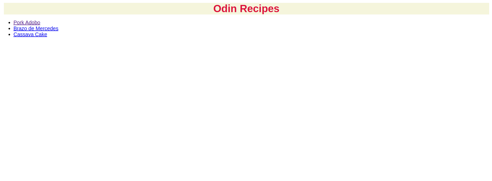

# Odin Recipes

## Description

[Odin Recipes](https://www.theodinproject.com/lessons/foundations-recipes) is a simple HTML project made for [The Odin Project](https://www.theodinproject.com).

It contains links to three Filipino-loved recipes. Check the live preview [here](https://pauloomartin.github.io/OdinProjects-Recipes/).

## Recipe Page

Each page contains an image, description, ingredients, and steps for the recipe. The recipe for each food is from [Panlasang Pinoy](https://www.panlasangpinoy.com).
